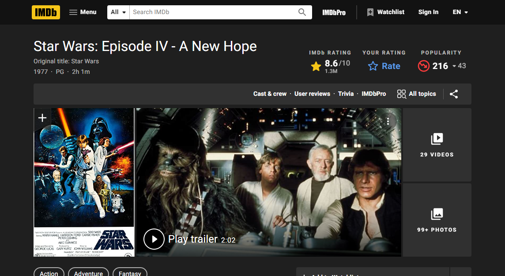

# node-imdb-parser

A html parser for imdb pages

# Badges

[](https://badge.fury.io/js/node-imdb-parser)

# Use

Import the library using `require`

```js
const { IMDBParser } = require('node-imdb-parser')
```

or ES6 `import`

```js
import { IMDBParser } from 'node-imdb-parser'
```

Call `title` to parse a movie page
```js
const parse = new IMDBParser()

const htmlText = getHTMLText() // via: fetch, browser's saving page, zip...
const data = parse.title( htmlText )


Movie {
  title: 'Star Wars',
  ...
}
```

# Parsers included

## title

title( htmlText, [site_version] )

## title / keywords

titleKeywords( htmlText, [site_version] )

# Site versions

## 2021 - A

<p align='center'>
	
</p>


```json
### title
{
  "info": {
    "id": "tt0076759",
    "release": "1977-05-25T04:00:00.000Z",
    "title": {
      "default": "Star Wars",
      "original": null,
      "akas": [
        "La guerra de las estrellas"
      ]
    },
    "onAir": "PG",
    "classification": "Rated PG for sci-fi violence and brief mild language",
    "genres": [
      "Action",
      "Adventure",
      "Fantasy"
    ],
    "type": "movie",
    "tagline": "It's Back! The Force will be with you for three weeks only. (1979 Reissue Poster)",
    "keywords": [
      "rebellion",
      "galactic war",
      "princess",
      "lightsaber",
      "space opera"
    ],
    "language": [
      "English"
    ],
    "production": [
      {
        "name": "Lucasfilm",
        "href": "/company/co0071326?ref_=tt_dt_co_1"
      },
      {
        "name": "Twentieth Century Fox",
        "href": "/company/co0000756?ref_=tt_dt_co_2"
      }
    ],
    "filmLocations": "Tikal National Park, Guatemala",
    "countryOfOrigin": "United States",
    "ratings": {
      "imdb": {
        "rating": "8.6",
        "votes": "1.3M"
      },
      "metascore": "90"
    },
    "tech": {
      "color": [],
      "soundmix": [],
      "aspectRatio": "",
      "runtime": "2 hours 1 minute"
    },
    "links": {
      "officialSite": [
        "Disney+ Hotstar",
        "Lucasfilm Ltd. (United States)"
      ]
    }
  },
  "media": {
    "poster": "https://m.media-amazon.com/images/M/MV5BNzVlY2MwMjktM2E4OS00Y2Y3LWE3ZjctYzhkZGM3YzA1ZWM2XkEyXkFqcGdeQXVyNzkwMjQ5NzM@._V1_QL75_UX380_CR0,14,380,562_.jpg",
    "trailer": "/video/vi1317709849?playlistId=tt0076759&ref_=tt_ov_vi",
    "photos": [
      "https://m.media-amazon.com/images/M/MV5BMTk3MTkzNTk3Ml5BMl5BanBnXkFtZTgwOTcyMzQyNDM@._V1_QL75_UY280_CR43,0,280,280_.jpg"
    ],
    "videos": [
      "/video/vi1317709849/?ref_=tt_vi_i_1"
    ]
  },
  "crew": {
    "directors": [
      {
        "name": "George Lucas",
        "id": "nm0000184"
      }
    ],
    "stars": [
      {
        "name": "Mark Hamill",
        "id": "nm0000434"
      },
      {
        "name": "Harrison Ford",
        "id": "nm0000148"
      },
      {
        "name": "Carrie Fisher",
        "id": "nm0000402"
      }
    ],
    "cast": [
      {
        "id": "nm0000434",
        "avatar": "https://m.media-amazon.com/images/M/MV5BOGY2MjI5MDQtOThmMC00ZGIwLWFmYjgtYWU4MzcxOGEwMGVkXkEyXkFqcGdeQXVyMzM4MjM0Nzg@._V1_QL75_UY140_CR55,0,140,140_.jpg",
        "name": "Mark Hamill",
        "episodes": "",
        "year": ""
      },
      {
        "id": "nm0000148",
        "avatar": "https://m.media-amazon.com/images/M/MV5BMTY4Mjg0NjIxOV5BMl5BanBnXkFtZTcwMTM2NTI3MQ@@._V1_QL75_UX140_CR0,11,140,140_.jpg",
        "name": "Harrison Ford",
        "episodes": "",
        "year": ""
      },
      {
        "id": "nm0000402",
        "avatar": "https://m.media-amazon.com/images/M/MV5BMjM4ODU5MDY4MV5BMl5BanBnXkFtZTgwODY1MjQ5MDI@._V1_QL75_UX140_CR0,15,140,140_.jpg",
        "name": "Carrie Fisher",
        "episodes": "",
        "year": ""
      }
    ]
  },
  "related": [
    {
      "id": "tt0080684",
      "poster": "https://m.media-amazon.com/images/M/MV5BYmU1NDRjNDgtMzhiMi00NjZmLTg5NGItZDNiZjU5NTU4OTE0XkEyXkFqcGdeQXVyNzkwMjQ5NzM@._V1_QL75_UX140_CR0,5,140,207_.jpg",
      "title": "Star Wars: Episode V - The Empire Strikes Back"
    },
    {
      "id": "tt0086190",
      "poster": "https://m.media-amazon.com/images/M/MV5BOWZlMjFiYzgtMTUzNC00Y2IzLTk1NTMtZmNhMTczNTk0ODk1XkEyXkFqcGdeQXVyNTAyODkwOQ@@._V1_QL75_UX140_CR0,5,140,207_.jpg",
      "title": "Star Wars: Episode VI - Return of the Jedi"
    },
    {
      "id": "tt0121766",
      "poster": "https://m.media-amazon.com/images/M/MV5BNTc4MTc3NTQ5OF5BMl5BanBnXkFtZTcwOTg0NjI4NA@@._V1_QL75_UY207_CR8,0,140,207_.jpg",
      "title": "Star Wars: Episode III - Revenge of the Sith"
    }
  ],
  "seasons": [],
  "version": 3
}

```
# FAQ

## FAQ1

ANSWER1
